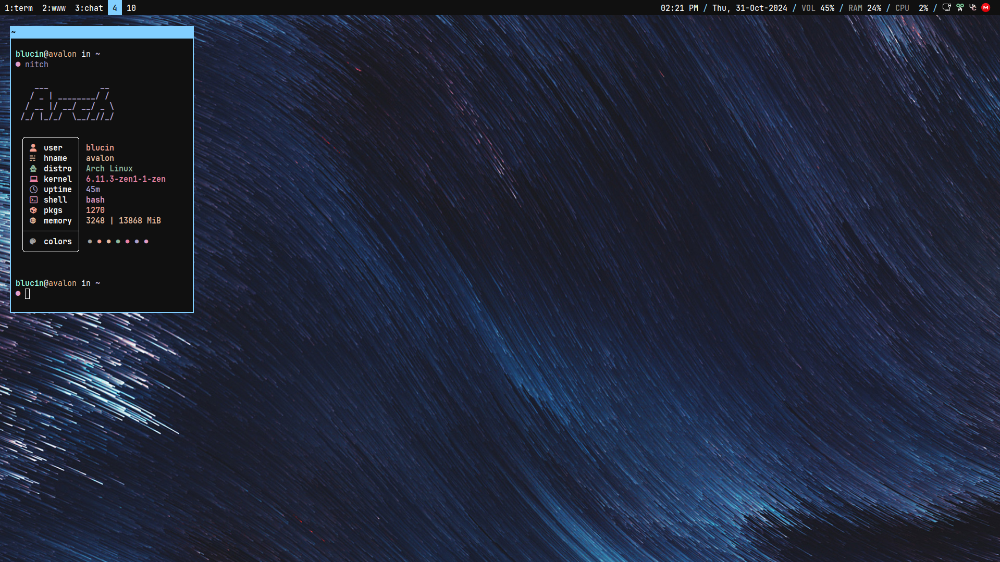
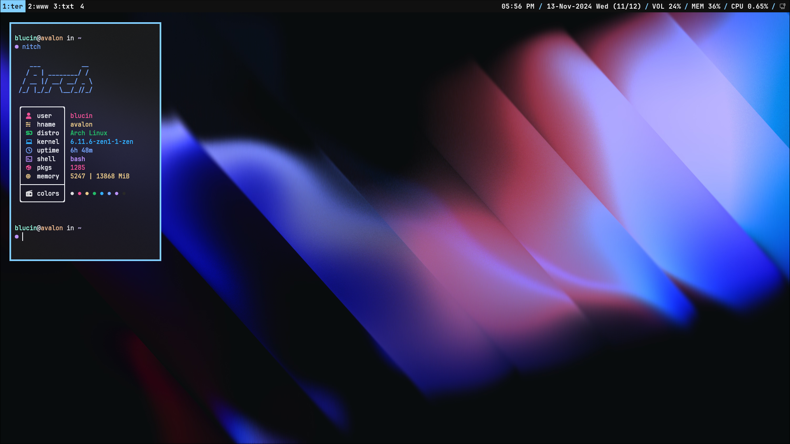

# dot-files-arch (i3wm x11 + hyprland wayland)

**A X11 first dot files for Arch Linux. This repo contains my personal dot files for my Arch Linux setup. For wayland support you only need to stow 2 extra directories: `hypr` and `waybar`.**

- [dot-files-arch (i3wm x11 + hyprland wayland)](#dot-files-arch-i3wm-x11--hyprland-wayland)
  - [Screenshots](#screenshots)
  - [Getting Started](#getting-started)
  - [Setting GTK and Qt themes](#setting-gtk-and-qt-themes)

## Screenshots

| WM | Screenshot |
| -- | ---------- |
| i3wm |  |
| hyprland (new, wip) |  |

## Getting Started

1. Clone the repo

```bash
cd ~
git clone https://github.com/blucin/dot-files-arch .dotfiles
cd ~/.dotfiles
```

2. Install necessary fonts
    - `ttf-jetbrains-mono-nerd`
    - `ttf-icomoon-feather`

3. Install `neovim` and [`lunarvim`](https://www.lunarvim.org/)

3. Install necessary dependencies

```
stow alacritty btop fish fastfetch i3 polybar network-manager-applet zellij rofi qt5ct qt6ct lxappearance kvantum nwg-appearance kvantum-qt5 playerctl
```
> [!IMPORTANT] 
> grab all the members of the package i3 `i3-wm`, `i3blocks`, `i3lock`, `i3status`

Some additional packages that I use

```
pacman-contrib ufw lazygit thunar thunar-archive-plugin gvfs thunar-media-tags-plugin thunar-volman xarchiver zip keepassxc ristretto bat
```

4. Make sure that the scripts under `~/.dotfiles/scripts/` are executable

```bash
ls -l ~/.dotfiles/scripts/
chmod +x ~/.dotfiles/scripts/*
```

5. Stow all the dot files (Make sure you clone the repo in $HOME)

```bash
    stow i3
    stow lvim
    stow fastfetch
    stow alacritty
    ...
```
> [!NOTE]
> You can choose not to stow `hypr` and `waybar` if you don't want the hyprland config

> [!NOTE]
> This will automatically symlink the config files

## Setting GTK and Qt themes

| Name | Description |
| ----- | ----------- |
| Icon theme | Fluent Icon Pack |
| GTK theme | Adwaita Dark |
| Kvantum theme | KvGnomeDark |
| Qt6 theme | kvantum-dark |
| Qt5 theme | kvantum-dark |

- Set some environment variables in `etc/environment`

```conf
QT_QPA_PLATFORMTHEME=qt5ct
XDG_CONFIG_HOME=/home/blucin/.config
```

> [!NOTE]
> 1. Use `nwg-appearance` and `lx-apperance` to set gtk-themes
> 2. Use `kvantum manager`, `qt5ct`, and `qt6ct` to set qt-themes

> [!IMPORTANT]
> 1. Enter absolute path for `XDG_CONFIG_HOME` in `/etc/environment`
> 2. For qt5 applications you need `kvantum-qt5` for `qt5ct` to detect kvantum themes
> 3. For gtk 4.0 apps to pick up dark mode and theme
> `stow xdg-desktop-portal` or create `~/.config/xdg-desktop-portal/portals.conf` with. If it does not work, set the theme manually using `GTK_THEME` variable in `/etc/environment`
> ```conf
> [preferred]
> default=gtk;wlr
> ```